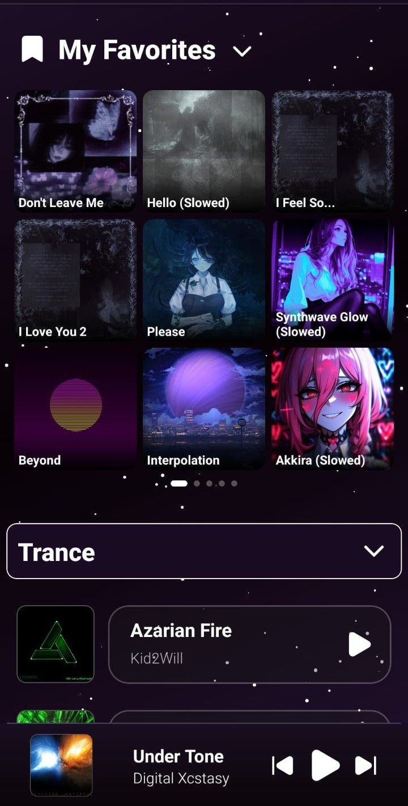
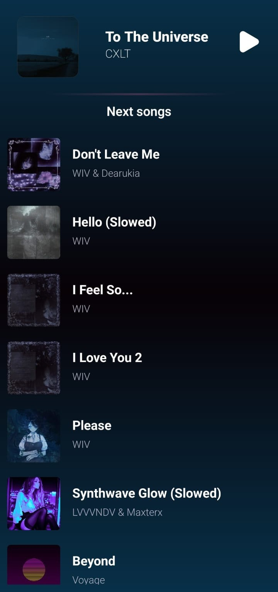
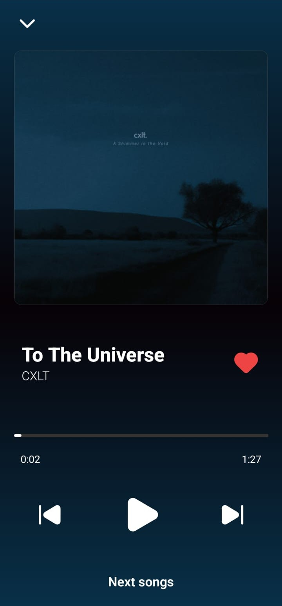

# 🎧 **Cosmic Player - React Native Music Player**

Aplicación móvil desarrollada con React Native (Expo), inspirada en plataformas como YouTube Music.  
Enfocada en ofrecer una experiencia de usuario fluida, interfaces modernas y una arquitectura clara y escalable.

---

## ✨ **Features**

- 🎵 Reproducción de música
- 📱 Navegación entre pantallas (React Navigation)
- 🧠 Manejo de estado global con Context API
- 💾 Persistencia de datos (historial de reproducción)
- ⚡ Optimización de rendimiento con hooks (useMemo, useEffect)
- 🎨 Animaciones para mejorar la experiencia de usuario
- 📐 Diseño responsive enfocado en mobile

---

## 📱 **Preview**





---

## 🛠️ **Tech Stack**

- React Native (Expo)
- JavaScript / TypeScript
- React Navigation
- Context API

---

## 🚀 Getting Started

```bash
git clone https://github.com/tu-usuario/tu-repo.git
cd tu-repo
npm install
npx expo start
